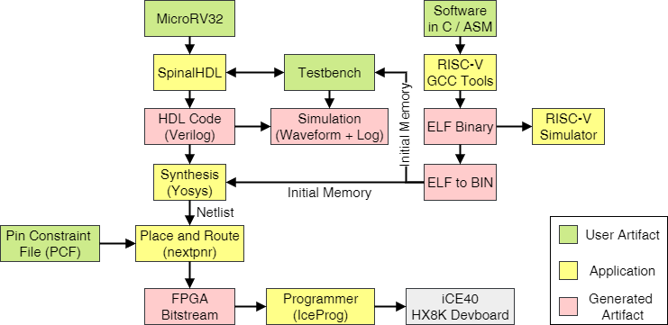
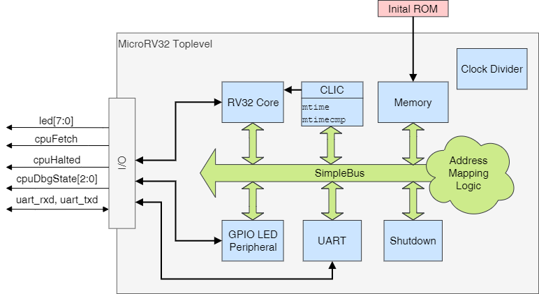
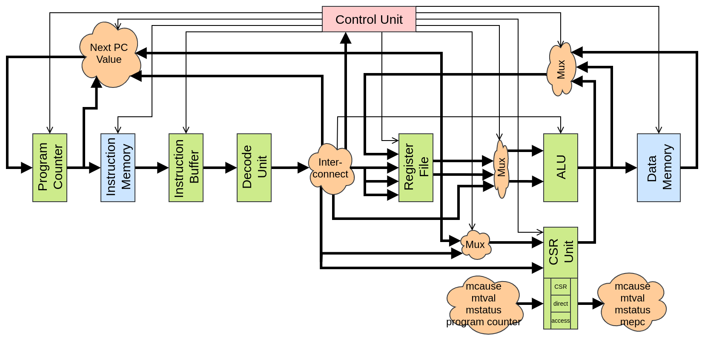
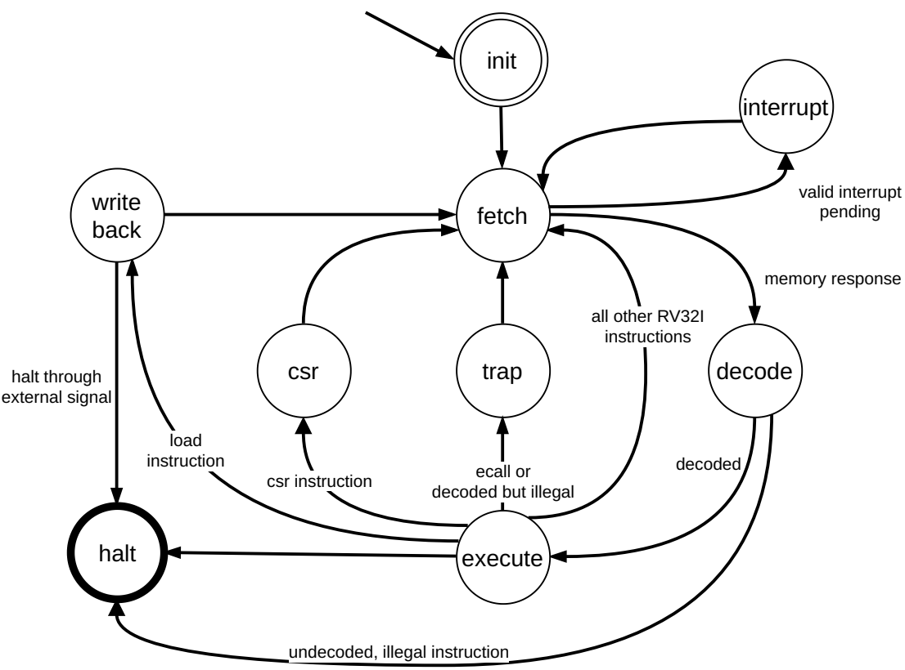

µRV32 - MicroRV32
===
## Key features of our µRV32
* VP based co-design and co-simulation tool flow
* RV32IMC core support with CSR Registers for SW traps and timer IRQ
* CLINT/CLIC based timer interrupt
* Peripherals 
    * GPIO
    * UART
    * LEDs
    * Shutdown
* FreeRTOS support
* Suitable for FPGA synthesis (tested on Lattice Semiconductor HX8K)
* Software examples for platform use with platform dependent code available



For related information, e.g. verification, please visit http://www.informatik.uni-bremen.de/agra/projects/risc-v/ or contact riscv@informatik.uni-bremen.de. We accept pull requests and in general contributions are very welcome.

## Prerequisites
To fully operate the µRV32 several requirements are needed.

### RISC-V Toolchain
Compiling the RISC-V software in the `sw` directory the [offcial RISC-V GNU toolchain](https://github.com/riscv/riscv-gnu-toolchain) is needed.
The toolchain has to be installed and used as the `rv32imc` variant. To configure the installation as such use this configure command:
```bash
./configure --prefix=<RV32I-DIST-PATH> --with-arch=rv32imc --with-abi=ilp32
```

### RISC-V VP
Using the RISC-V Virtual Prototype (VP) has a seperate list of prerequisits which need to be fulfilled in order to run the VP. 
The VP contains a platform implementation of the µRV32, called `microrv32-vp`, that can be used to develop software and prepare ISA and platform extensions.
Refer to the [RISC-V VP Github repository](https://github.com/agra-uni-bremen/riscv-vp)  for further information.  


### SpinalHDL
Generating Verilog and simulating the SpinalHDL modules and the SoC requires the SpinalHDL toolchain. See the [official documentation](https://spinalhdl.github.io/SpinalDoc-RTD/SpinalHDL/Getting%20Started/getting_started.html#requirements-things-to-download-to-get-started) or the [SpinalHDL base project](https://github.com/SpinalHDL/SpinalTemplateSbt). For simulation the Verilator backend of SpinalHDL is used. Further information on SpinalHDL can be found in the [official GitHub repository](https://github.com/SpinalHDL/SpinalHDL). The Makefiles in this project make use of the SBT-Version of SpinalHDL.
The `microrv32` directory contains the `README.md` from the SpinalTemplateSbt Base Project for this purpose.

### IceStorm FPGA Toolchain
To synthesize and configure the MicroRV32 onto an FPGA the [IceStorm Toolchain](http://bygone.clairexen.net/icestorm/) is used. Necessary tools from the installation guide are `IceStorm Tools (icepack, icebox, iceprog, icetime, chip databases)`, `NextPNR (place&route tool, Arachne-PNR replacement)` and `Yosys (Verilog synthesis)`.

## Overview 
µRV32 is bundle of a SpinalHDL based RTL implementation of the RISC-V ISA and a SystemC TLM 2.0 based VP of the RTL model.
The platform is built for the use on FPGAs and aims for research and educational use. 
The VP enables fast development and design exploration cycles for software development and hardware extensions of the ISA or the platform.

The following description elaborates on the details of the RTL implementation. For further information on the VP visit the [Github repository of the VP](https://github.com/agra-uni-bremen/riscv-vp)

The RV32 core was tested with the [official RISC-V unit tests](https://github.com/riscv/riscv-tests) and [RISC-V Formal Verification Framework](https://github.com/YosysHQ/riscv-formal).



Peripherals on platform:
* Shutdown peripheral: Transitions platform into defined halting state until reset
* LED peripheral: Maps FPGA development board LEDs as periphieral to platform
* UART peripiheral: Serial transmit/receive (currently at fixed baudrate and polling only) -- best used as output-terminal
* CLIC (Core Local Interrupt Controller): Provide RISC-V compliant timer interrupt via `mtime` and `mtimecmp`, if `mtime >= mtimecmp` interrupt is pending (if enabled)
* GPIO (General Purpose Input Output): Offers 8-bit wide GPIO banks that can be added in the toplevel and mapped to the users need, the default platform includes one GPIO bank. Each GPIO bank has a register for the direction, the input and the output values. 

These are memory mapped into the global address space of the RV32 core.

For the purpose of FPGA usage a toplevel configuration for the use on the Lattice Semiconductor HX8K FPGA is in `MicroRV32TopHX8K.scala`. There a `SB_IO` primitive for the GPIO use through the Lattice Semiconductor Technology Library has been used. A seperate top level has been made available since the primitive cannot be simulated with Verilator.

The RV32 core is built in a classical RTL compatible structure of a datapath controlled by a finite state machine. Thus the RISC-V core of the MicroRV32 is a multi-cycle microarchitecture.


The datapath controlled by the control unit is structurally described by the following diagram.



The microarchitecture is not pipelined and supports functionality to pass [riscv-formal](https://github.com/YosysHQ/riscv-formal), [riscv-tests](https://github.com/riscv/riscv-tests) and supports interrupts from a timer interrupt. The components can be found in `rv32core` directory inside the `src/main/scala/core/microrv32` directory. The diagrams do not show additional extensions like the C (support for compressed instructions) and M (multiplication, division and remainder) extension as these additions either add more detail to existing modules or add another unit for the execution behavior at existing places. Feel free to ask questions through the issues.

For the finite state machine of the control unit refer to the state diagram.



Interrupts are checked before each new fetch and transition the program flow to the traphandler of the software. After return from the traphandler, the program execution continues at the last instruction according to the RISC-V ISA Specification.

## Memory map of the SoC

Peripheral | Start Address | End Address
---|---|---
CLIC       | 0x02000000 | 0x0200FFFF
Shutdown   | 0x02010000 | 0x020103FF
Memory     | 0x80000000 | 0x80FFFFFF
LEDs       | 0x81000000 | 0x8100000F
UART       | 0x82000000 | 0x820000FF
GPIO       | 0x83000000 | 0x830000FF

## Using and executing examples
The platform comes with several software examples testing components and showing the useage of periphrals in the RISC-V environment.

Next to handwritten C and Assembly software examples there are some prebuilt freeRTOS binaries for the MicroRV32 platform. They can be found in `sw/freeRTOS-prebuilt` and are named after the freeRTOS example demos for reference.
Additionally the official `riscv-tests` unit tests can be found in `sw/riscv-test-rv32uip-prebuilt` as built binaries ready for execution.

The Makefile provides some commonly used commands to build the SoC, run simulations or the synthesis + place&route process.

### Generating hex Files

Usually the software examples in `sw/` are compiled into the ELF binary format by the RISC-V toolchain.
Currently the MicroRV32 does not provide an interface to flash these ELF files directly into the memory (neither for initial or during runtime).

For this we currently provide a ELF-to-BIN script (`sw/elf2bin.py`) which extracts the instruction and data memory sections from the ELF and writes them in a hex-format into a file (`*.hex`). 
The provided executable binaries should come in that format, if not, the Makefile within a directory for the software should provide a proper call for the elf2bin script.

If software is written and should be a hex file is supposed to be generated to run on the MicroRV32 use the provided script.
Its called with 3 parameters: The ELF file, the target output filename, a target size for the hexfile.
The target size should be a multiple of 8, which is currently not checked by the script, but asserted by the memory into which the software get loaded to.
If the provided size is not fitting for the passed ELF then the script will notify the user what the minimum size required is.

### Common issues building the µRV32
This section aims to collect a few of the common errors that one encounters building and simulating the platform.

* When trying to generate RTL or synthesize the platform for FPGA use, one error that can occur is: `[error] Exception in thread "main" java.io.FileNotFoundException: rtl/MicroRV32Top.v (file or directory not found)`. This will mainly happen when thee is not `rtl` directory available, as SpinalHDL and the Makefile do not create or check for this. To resolve this issue, create a directory called `rtl`.

## Additional documenation on the peripheral registers

### UART
The UART peripheral currently provides payload and control register for receive and transmit.
The transmit side does not provide a fifo yet, therefore needs to be polled on the `ready` register for usage.
The following table provides an overview of the available payload, control and status registers. (W=Write, R=Ready, O=Only (RO = Ready Only, WO = Write Only))

Global address | Local addresss | Description | Mode
---|---|---|---
0x82000000 | 0x00 | TXD Payload Register (write you payload you want to transmit in here) | WO
0x82000004 | 0x04 | TXD Control and Status Register (write 1 to transmit payload, read to receive if TXD is ready to transmit). Also see next two entries| RW
\ | \ | TXD Control Send Payload (write '1' into register to activate transmission of TXD payload) | W
\ | \ | TXD Ready Status (read, if value is '1' then TXD can transmit, if value is '0' transmission is going on or TXD is blocked) | R
0x82000008 | 0x08 | RXD Payload Register (read returns value from RXD UART and thus decreases the occupancy of the FIFO) | RO           
0x8200000C | 0x0C | RXD FIFO Occupancy (returns number of elements in FIFO) | RO
0x82000010 | 0x10 | RXD FIFO Almost Empty (returns '1' if FIFO contains one element) | RO
0x82000014 | 0x14 | RXD FIFO Empty (returns '1' if FIFO is empty) | RO


### GPIO
The GPIO peripheral offers lightweight I/O pin functionaly. The GPIO bank is 8 bit wide and multiple ones can be added in the toplevel design, and mapped to various parts of the address space. The peripheral offers a register to set the direction of each of the 8 pins. By default all pins are set to input mode. The input values are not debounced in the periphral. 
The following table provides an overview of the available registers. (W=Write, R=Ready, O=Only (RO = Ready Only, WO = Write Only))

Global address | Local addresss | Description | Mode
---|---|---|---
0x83000000 | 0x00 | Direction register, default=0x00, setting a bit to one, sets the respective GPIO pin as output, and forwards the value of bit at the output register to the GPIO pin | RW
0x83000004 | 0x04 | Output register, default=0x00, setting a bit to one, sets the respective pin for the tri-state driver. If the tri-state direction is set to output (see direction register) then its forwarded to the respective GPIO pin | RW
0x83000008 | 0x08 | Input register, reading from this will return the logic values on each pin, if the direction is set to read in the values from the GPIO pins (default, see direction register). If a bit is set 1 it correlates to logic HIGH, if a bit is set 0 it correclates to logic LOW. The GPIO pin is forwarded through two D-Flipflops for synchronization and stabilization. No debouncing is present. | RO


## FPGA Statistics 

The following Synthesis + Place & Route statistics are for the MicroRV32TopHX8K.scala @ commit 439666f with the initial ROM: blink.hex (32 bits x 100 words). FPGA target: Lattice Semiconductor HX8K FPGA (target = 12 MHz)

The SoC Platform w/ peripherals:

Description | RISC-V Core Configuration | | | |
---|---|---|---|---|
Variant | RV32I | RV32IM | RV32IC | RV32IMC
Maximum frequency f_max | 21.06 MHz | 22.31 MHz | 19.23 MHz | 20.28 MHz
Logic Cells | 3880 / 7680 (50%) | 4952 / 7680 (64%) |  4105 / 7680 (53%) |  5143 / 7680 (66%) 
Memory | 9/32 (28%) | 9/32 (28%) | 9/32 (28%) | 9/32 (28%)
Synthesis Time (yosys) | 19.52 s | 23.61 s | 22.23 s | 27.03 s
Place & Route Time (nextpnr) | 18.31 | 17.86 s | 14.76 s | 21.57 s

Just the RISC-V processor without the platform or peripherals:

Description | RISC-V Core Configuration | | | |
---|---|---|---|---|
Variant | RV32I | RV32IM | RV32IC | RV32IMC
Maximum frequency f_max | 41.65 MHz | 43.34 MHz | 29.91 MHz | 35.62 MHz
Logic Cells | 2068 / 7680 (26%) | 3244 / 7680 (42%) |  2344 / 7680 (30%) |  3444 / 7680 (44%) 
Memory | 4/32 (12%) | 4/32 (12%) | 4/32 (12%) | 4/32 (12%)
Synthesis Time (yosys) | 10.34 s | 14.62 s | 13.09 s | 17.27 s
Place & Route Time (nextpnr) | 9.16 | 13.32 s | 9.91 s | 14.43 s


## How to cite
Further details of the MicroRV32 are described in the folliwng [publication](https://doi.org/10.1016/j.sysarc.2022.102757):

```
@article{AHMADIPOUR2022102757,
title = {The MicroRV32 framework: An accessible and configurable open source RISC-V cross-level platform for education and research},
journal = {Journal of Systems Architecture},
volume = {133},
pages = {102757},
year = {2022},
issn = {1383-7621},
doi = {https://doi.org/10.1016/j.sysarc.2022.102757},
author = {Sallar Ahmadi-Pour and Vladimir Herdt and Rolf Drechsler},
}
```

## Acknowledgements
This work was supported in part by the German Federal Ministry of Education and Research (BMBF) within the project Scale4Edge under contract no.~16ME0127 and within the project VerSys under contract no.~01IW19001 and within the project ECXL.
