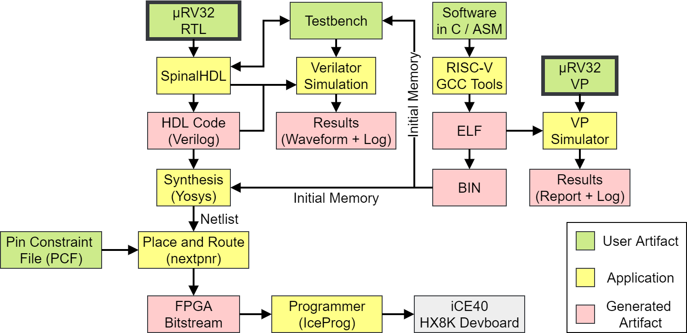
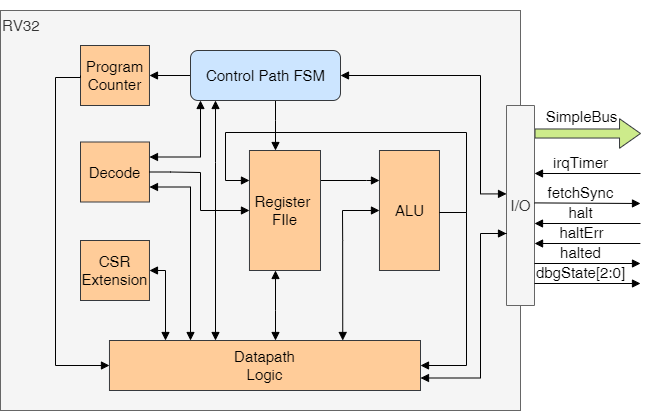

µRV32 - MicroRV32
===
## Key features of our µRV32
* VP based co-design and co-simulation tool flow
* RV32I core support with CSR Registers for SW traps and timer IRQ
* CLINT/CLIC based timer interrupt
* Peripherals 
    * UART
    * LEDs
    * Shutdown
* FreeRTOS support
* Suitable for FPGA synthesis (tested on Lattice Semiconductor HX8K)
* Software examples for platform use with platform dependent code available



For related information, e.g. verification, please visit http://www.systemc-verification.org/ or contact riscv@systemc-verification.org. We accept pull requests and in general contributions are very welcome.

## Prerequisites
To fully operate the µRV32 several requirements are needed.

### RISC-V Toolchain
Compiling the RISC-V software in the `sw` directory the [offcial RISC-V GNU toolchain](https://github.com/riscv/riscv-gnu-toolchain) is needed.
The toolchain has to be installed and used as the `rv32i` variant. To configure the installation as such use this configure command:
```bash
./configure --prefix=<RV32I-DIST-PATH> -march=rv32i -mabi=ilp32
```

### RISC-V VP
Using the RISC-V Virtual Prototype (VP) has a seperate list of prerequisits which need to be fulfilled in order to run the VP. 
The VP contains a platform implementation of the µRV32, called `microrv32-vp`, that can be used to develop software and prepare ISA and platform extensions.
Refer to the RISC-V VP `README.md` for further information.  


### SpinalHDL
Simulating the SpinalHDL modules and the SoC requires the SpinalHDL toolchain. See the [official documentation](https://spinalhdl.github.io/SpinalDoc-RTD/SpinalHDL/Getting%20Started/getting_started.html#requirements-things-to-download-to-get-started) or the [SpinalHDL base project](https://github.com/SpinalHDL/SpinalTemplateSbt). For simulation the Verilator backend of SpinalHDL is used. Further information on SpinalHDL can be found in the [official GitHub repository](https://github.com/SpinalHDL/SpinalHDL). The Makefiles in this project make use of the SBT-Version of SpinalHDL.
The `microrv32` directory contains the `README.md` from the SpinalTemplateSbt Base Project for this purpose.

### IceStorm FPGA Toolchain
To synthesize and configure the MicroRV32 onto an FPGA the [IceStorm Toolchain](http://www.clifford.at/icestorm/) is used. Necessary tools from the installation guide are `IceStorm Tools (icepack, icebox, iceprog, icetime, chip databases)`, `NextPNR (place&route tool, Arachne-PNR replacement)` and `Yosys (Verilog synthesis)`.

## Overview 
µRV32 is bundle of a SpinalHDL based RTL implementation of the RISC-V ISA and a SystemC TLM 2.0 based VP of the RTL model.
The platform is built for the use on FPGAs and aims for research and educational use. 
The VP enables fast development and design exploration cycles for software development and hardware extensions of the ISA or the platform.

The following description elaborates on the details of the RTL implementation. For further information on the VP visit the [Github repository of the VP](https://github.com/agra-uni-bremen/riscv-vp)

The RV32 core was tested with the [official RISC-V unit tests](https://github.com/riscv/riscv-tests).


Peripherals on platform:
* Shutdown peripheral: Transition platform into defined halting state until reset
* LED peripheral: Maps FPGA development board LEDs as periphieral to platform
* UART peripiheral: Serial transmit/receive (currently at fixed baudrate and polling only) -- best used as output-terminal
* CLIC (Core Local Interrupt Controller): Provide timer interrupt via `mtime` and `mtimecmp`, if `mtime >= mtimecmp` interrupt is pending (if enabled)

These are memory mapped into the global address space of the RV32 core.

The RV32 core is built in a classical RTL compatible structure of a datapath controlled by a finite state machine.



For the finite state machine refer to the state diagram.


Interrupts are checked before each new fetch and transition the program flow to the traphandler of the software. After return from the traphandler, the program execution continues at the last instruction.

## Memory map of the SoC

Peripheral | Start Address | End Address
---|---|---
CLIC       | 0x02000000 | 0x0200FFFF
Shutdown   | 0x02010000 | 0x020103FF
Memory     | 0x80000000 | 0x80FFFFFF
LEDs       | 0x81000000 | 0x8100000F
UART       | 0x82000000 | 0x820000FF

## Using and executing examples
The platform comes with several software examples testing components and showing the useage of periphrals in the RISC-V environment.

Next to handwritten C and Assembly software examples there are some prebuilt freeRTOS binaries for the MicroRV32 platform. They can be found in `sw/freeRTOS-prebuilt` and are named after the freeRTOS example demos for reference.
Additionally the official `riscv-tests` unit tests can be found in `sw/riscv-test-rv32uip-prebuild` as built binaries ready for execution.

To run the examples the memory size has to be choosen according to the example being executed (this is due to the program being loaded into the memory before compilation/synthesis of the platform). In `src/main/scala/core/microrv32/` the file `MicroRV32Top.scala` contains all the components of the platform being interconnected. In line `51` the memory gets initiated with the program that should be exectued. In the lines above commented versions of this instantiation show the different memorysizes for each software:
```scala
// val ram = new Memory(Bits(32 bits),8704,initHexfile) // riscv-ui-p-tests
// val ram = new Memory(Bits(32 bits),4104,initHexfile) // basic-led-c, basic-c, basic-timerirq
// val ram = new Memory(Bits(32 bits),100,initHexfile) // basic-led-blink, basic-asm, basic-uart-asm
val ram = new Memory(Bits(32 bits),393216,initHexfile) // freeRTOS examples
```
Uncommenting the respective line instantiates the memory with the necessary memory sizes for the programs.

**Note**: the freeRTOS based examples and the RISC-V unit tests do not work on FPGA synthesized versions for the HX8K development board (the memory size is too small for these binaries).

After setting to respective memory size `make` can be used to execute the simulation. A list with make commands and short descriptions follows:
* `make sim_spinal` -- default simulation task, will simulate `sw/basic-led-blink/blink.hex` unless option `simROM` is passed with other binary (i.e. `make sim_spinal simROM="sw/basic-uart-asm/uart.hex`)
* `make sim_spinal_freeRTOS-*` -- shorthand simulation call for freeRTOS examples
* `rtl` -- generate Verilog from SpinalHDL
* `synth` -- synthesize core with defined software (see `MicroRV32Top.scala`) in IceStorm toolchain for HX8K FPGA (on devlopment board) with predefined Pin-Constraints (`vtb/synth/pins.pcf`)
* **Note**: `make show_sim_linux` and `make show_sim_win` are currently not supported due to GTKWave having issues with relative Paths. The user has to open the *.vcd Files from in the simWorkspace directory by hand and import the signals for scope and debugging purposes

## Additional documenation on the peripheral registers

### UART
The UART peripheral currently provides payload and control register for receive and transmit.
The transmit side does not provide a fifo yet, therefore needs to be polled on the `ready` register for usage.
The following table provides an overview of the available payload, control and status registers. (W=Write, R=Ready, O=Only (RO = Ready Only, WO = Write Only))

Global address | Local addresss | Description | Mode
---|---|---|---
0x82000000 | 0x00 | TXD Payload Register (write you payload you want to transmit in here) | WO
0x82000004 | 0x04 | TXD Control and Status Register (write 1 to transmit payload, read to receive if TXD is ready to transmit). Also see next two entries| RW
\ | \ | TXD Control Send Payload (write '1' into register to activate transmission of TXD payload) | W
\ | \ | TXD Ready Status (read, if value is '1' then TXD can transmit, if value is '0' transmission is going on or TXD is blocked) | R
0x82000008 | 0x08 | RXD Payload Register (read returns value from RXD UART and thus decreases the occupancy of the FIFO) | RO           
0x8200000C | 0x0C | RXD FIFO Occupancy (returns number of elements in FIFO) | RO
0x82000010 | 0x10 | RXD FIFO Almost Empty (returns '1' if FIFO contains one element) | RO
0x82000014 | 0x14 | RXD FIFO Empty (returns '1' if FIFO is empty) | RO

## Acknowledgements
This work was supported in part by the German Federal Ministry of Education and Research (BMBF) within the project Scale4Edge under contract no.~16ME0127 and within the project VerSys under contract no.~01IW19001.
